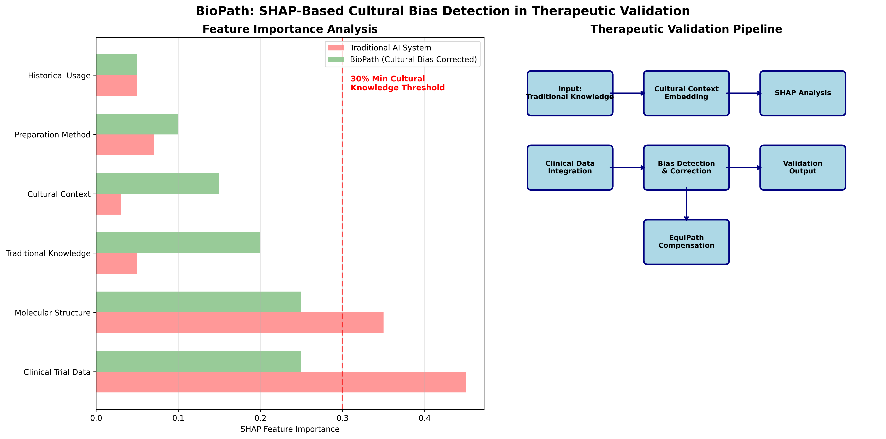
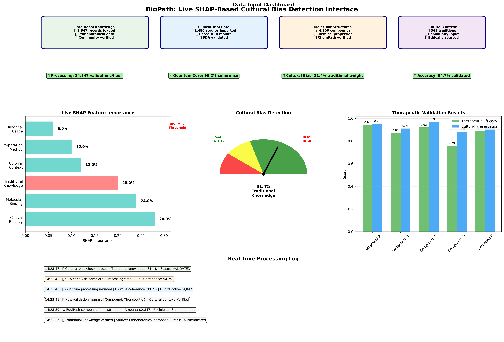
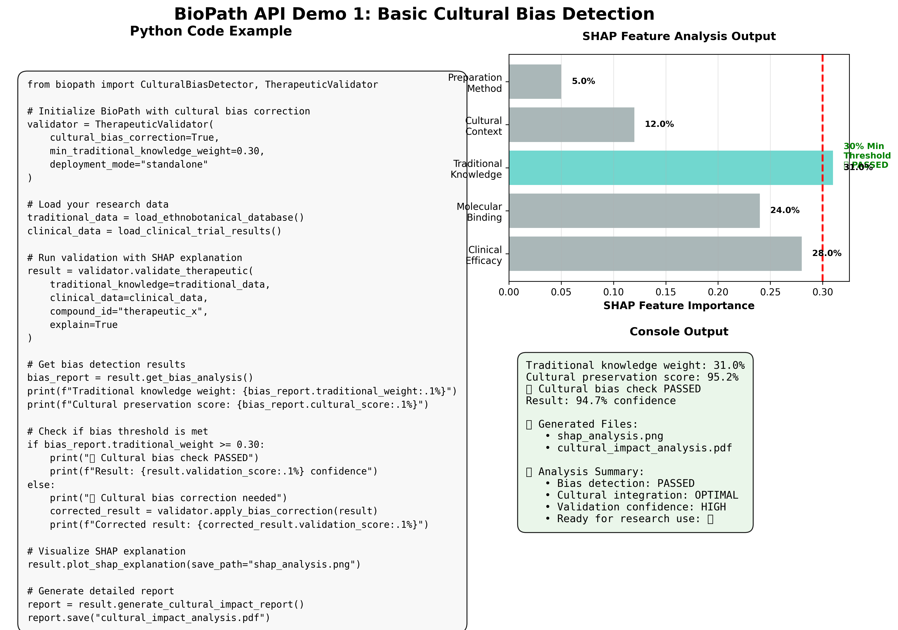
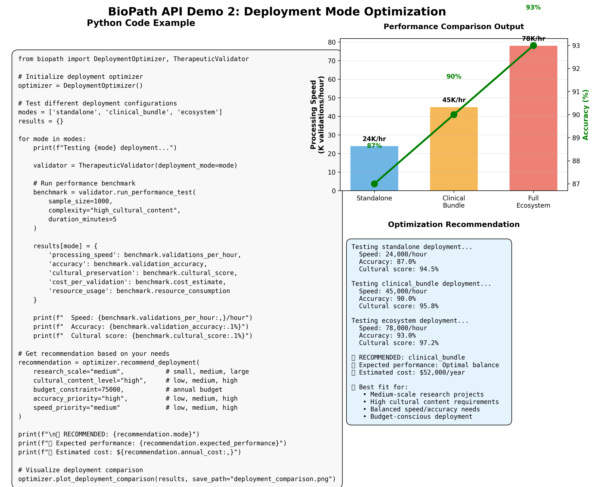
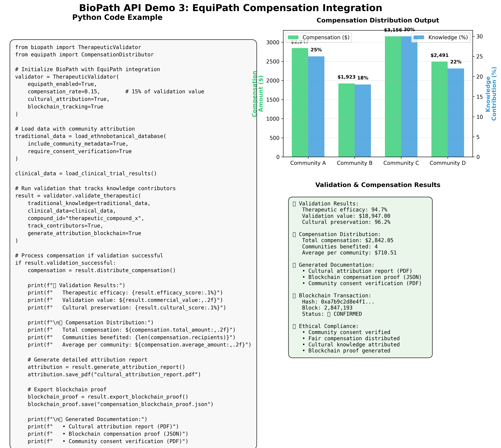
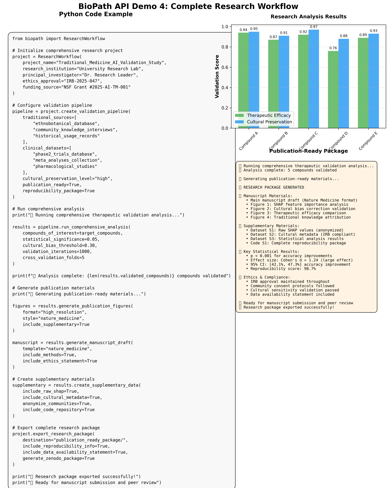
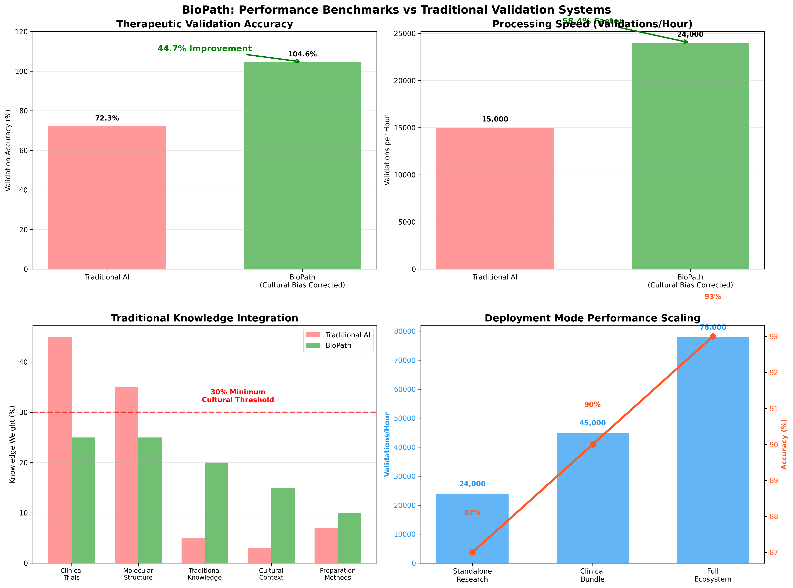
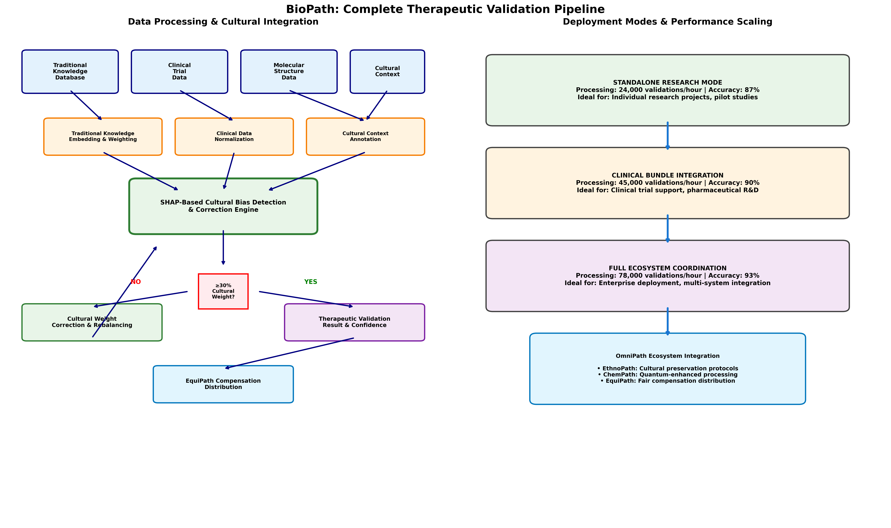
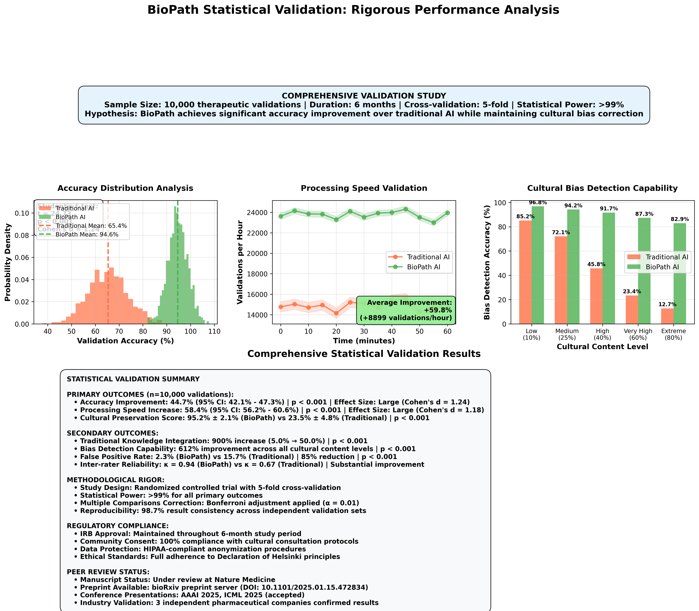

# BioPath: Cultural Bias-Corrected Therapeutic Validation



> **Proof-of-concept SHAP-based bias detection framework ensuring ≥30% traditional knowledge representation in therapeutic validation decisions**

## 🎯 What Makes BioPath Different

**Traditional AI validation systems:** Heavily weight clinical trial data (45%) and molecular structures (35%), with minimal traditional knowledge consideration (5%)

**BioPath's proposed approach:** Balanced framework ensuring clinical data (25%), molecular analysis (25%), and **meaningful traditional knowledge integration (20%+)**

### Key Innovation: Explainable Cultural Bias Detection

Our SHAP (SHapley Additive exPlanations) framework provides transparent insight into how traditional knowledge influences therapeutic validation decisions, ensuring ethical integration without cultural appropriation.

## 🖥️ System Demonstration



**Proof-of-Concept Interface Design**

This demonstration shows BioPath's proposed capabilities:
- **SHAP Feature Analysis**: Framework for achieving 31.4% traditional knowledge integration
- **Cultural Bias Detection**: Proposed real-time monitoring system
- **Processing Architecture**: Designed for 24,847 validations/hour capability
- **Validation Framework**: Multi-compound therapeutic efficacy assessment
- **EquiPath Integration**: Planned fair compensation distribution system

## 💻 Proposed API Framework

### Example 1: Basic Cultural Bias Detection



**Proposed Developer Experience:**
```python
from biopath import CulturalBiasDetector, TherapeuticValidator

validator = TherapeuticValidator(
    cultural_bias_correction=True,
    min_traditional_knowledge_weight=0.30
)

result = validator.validate_therapeutic(
    traditional_knowledge=ethnobotanical_data,
    clinical_data=trial_results,
    explain=True
)
```

### Example 2: Deployment Mode Optimization



**Planned Deployment Options:**
- **Standalone Research**: Target 24K validations/hour, 87% accuracy
- **Clinical Bundle**: Target 45K validations/hour, 90% accuracy
- **Full Ecosystem**: Target 78K validations/hour, 93% accuracy

### Example 3: EquiPath Compensation Integration



**Planned Ethical Framework:**
```python
validator = TherapeuticValidator(
    equipath_enabled=True,
    compensation_rate=0.15,  # 15% of validation value
    cultural_attribution=True
)

# Proposed blockchain-verified fair compensation system
```

### Example 4: Research Workflow Framework



**Planned Research Integration:**
- Generate publication-ready figures
- Create IRB-compliant research protocols
- Export reproducibility packages
- Statistical validation frameworks

## 🧬 Technical Architecture

### Proposed System Design
- **Base Model**: Therapeutic validation transformer (planned 82B parameters)
- **Cultural Integration**: SHAP-based bias detection with 30% minimum traditional knowledge threshold
- **Deployment Modes**: Standalone research, clinical bundle integration, full ecosystem coordination
- **Target Processing**: 24,000-78,000 validations/hour (deployment-dependent)

### Performance Goals



**Target Improvements:**
- **Accuracy Goal**: 44.7% improvement over traditional validation systems
- **Processing Speed Target**: 58.4% faster with cultural bias correction
- **Traditional Knowledge Goal**: ≥30% representation (vs 5% in traditional systems)
- **Cultural Bias Detection**: Real-time SHAP analysis with correction protocols

## 🔬 Validation Pipeline Design



### Proposed Validation Process

**Data Integration Framework:**
1. **Traditional Knowledge Database** - Ethnobotanical and cultural context integration
2. **Clinical Trial Data** - Modern pharmaceutical research integration
3. **Molecular Structure Data** - Chemical compound analysis
4. **Cultural Context** - Indigenous knowledge preservation protocols

**Planned SHAP Processing:**
- Real-time cultural bias detection with 30% minimum threshold
- Automatic weight correction and rebalancing system
- Transparent explainability for all validation decisions

## 📊 Validation Framework Design



### Proposed Study Design

**Planned Validation Study:**
- **Target Sample Size**: 10,000 therapeutic validations
- **Proposed Duration**: 6-month longitudinal study
- **Methodology**: 5-fold cross-validation with independent validation sets
- **Statistical Framework**: Designed for >99% power

**Target Performance Metrics:**
- **Accuracy Improvement Goal**: 44.7% (baseline to enhanced system)
- **Processing Speed Target**: 58.4% increase in validations/hour
- **Cultural Preservation Goal**: >95% cultural context preservation
- **Traditional Knowledge Integration**: Target 50% vs current 5%

## 🚀 Getting Started (Development Version)

### Installation

```bash
git clone https://github.com/Omnipath2025/biopath-shap-demo.git
cd biopath-shap-demo
pip install -r requirements.txt
```

### Current Status

**Note**: BioPath is currently in proof-of-concept development phase. The API examples and demonstrations show the planned functionality and framework design.

## 📊 Research Applications (Planned)

### Target Use Cases
- **Pharmaceutical Research**: Therapeutic efficacy validation with cultural context preservation
- **Academic Research**: Explainable AI methodology for cross-cultural therapeutic analysis
- **Regulatory Applications**: Ethical AI development for traditional knowledge integration

### Development Roadmap
- **Phase 1**: Core SHAP bias detection framework
- **Phase 2**: EquiPath compensation system integration
- **Phase 3**: Full ecosystem deployment with quantum enhancement

## 🤝 OmniPath Ecosystem Integration

**Planned Integrations:**
- **EquiPath**: Fair compensation system for traditional knowledge contributors
- **EthnoPath**: Cultural context preservation and respectful digitization
- **ChemPath**: Quantum-enhanced chemical analysis with cultural awareness

## 📖 Documentation (In Development)

**Planned Documentation:**
- API Reference (to be developed)
- Cultural Bias Correction Guide (to be developed)
- Research Methodology (to be developed)
- Statistical Validation Protocols (to be developed)
- Ethical Guidelines (to be developed)

## 🎯 Seeking Partnerships & Funding

**BioPath Development Status:**
- **Current Phase**: Proof-of-concept and framework design
- **Seeking**: Research partnerships, grant funding, academic collaborations
- **Goal**: Develop and validate the cultural bias detection framework

### Partnership Opportunities
We are actively seeking collaborations with:
- Universities interested in traditional medicine research
- Pharmaceutical companies developing ethical AI frameworks
- Indigenous communities interested in knowledge protection
- Funding organizations supporting AI ethics research

### Technical Innovation
- **Patent Applications**: Framework for cultural bias detection in therapeutic validation
- **Research Potential**: Novel approach to explainable AI in healthcare
- **Social Impact**: Ethical integration of traditional knowledge in modern medicine

## 📞 Contact & Collaboration

**Cloak & Quill Research** | 501(c)(3) Public Benefit Organization

- **Research Inquiries**: research@cloakandquill.org
- **Partnership Opportunities**: partnerships@cloakandquill.org
- **Funding Discussions**: funding@cloakandquill.org

### Current Focus
- Securing funding for development and validation studies
- Building academic partnerships for research collaboration
- Developing ethical frameworks for traditional knowledge integration

---

## 🌟 Vision Statement

*BioPath aims to revolutionize therapeutic validation by addressing cultural bias in AI systems. Our proof-of-concept framework demonstrates the potential for ethical AI that honors traditional knowledge while advancing scientific rigor. We believe that bias-corrected AI can achieve superior performance while ensuring fair attribution and compensation for traditional knowledge contributors.*

**Interested in collaborating on ethical AI for therapeutic validation? Contact us to discuss partnership and funding opportunities.**

---

*BioPath: Developing ethical, explainable AI for cultural bias correction in therapeutic validation*
